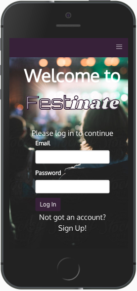
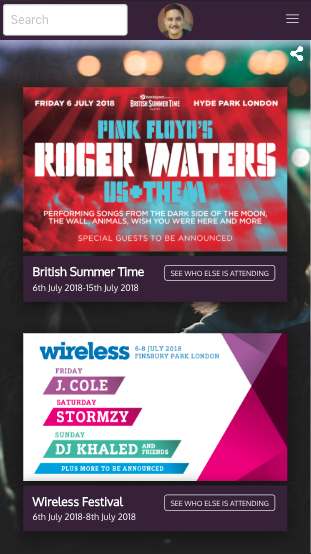
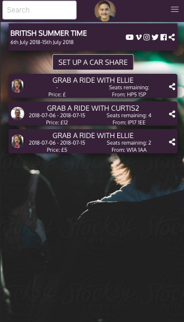
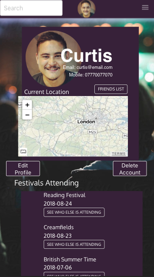

# General Assembly WDI Project 3: Festinate (Group Project)

  

[Visit the Easel app on Heroku](https://festinate.herokuapp.com/)

[View the Easel app on GitHub](https://github.com/curtisburns/festival-companion-app)

## Brief
Your instructors will partner you with other classmates to design and collaboratively build a MEAN stack app of your own design.

Your app must:
* Use Mongo, Node & Express to build a server-side API
* Your API must have at least 2 related models, one of which should be a user
* Your API should include all RESTFUL actions for at least one of those models
* Include authentication to restrict access to appropriate users
* Include at least one referenced or embedded sub-document, however don't go crazy! You need to manage your time effectively...
* Include automated tests for at least one resource
* Use Angular to build a front-end that consumes your API
* Use SCSS instead of CSS
* Use Webpack & Yarn to manage your dependencies and compile your source code

## App Description
Festinate is a festival companion app, designed for mobile first. The purpose of the app is for festival organisers to be able to add the event to the feed so that users can confirm their attendance and arrange car shares, while also being informed of the weather for upcoming events. This is achieved through the use of a passenger and attendee system and external APIs such as MapQuest and Dark Sky.

## Technologies Used
* HTML5
* SCSS
* JavaScript(ECMAScript 6)
* Node.js
* angular: v1.7.3
* @uirouter/angularjs: v1.0.20
* bulma: v0.7.1
* moment: v2.22.2
* satellizer: v0.15.5
* MongoDB
* bcrypt: v3.0.0
* bluebird: v3.5.1
* body-parser: v1.18.3
* express: v4.16.3
* jsonwebtoken: v8.3.0
* mongoose: v5.2.8
* morgan: v1.9.0
* request-promise: v4.2.2
* chai: v4.1.2
* mocha: v5.2.0
* nyc: v12.0.2
* supertest: v3.1.0
* Git
* GitHub
* Heroku
* Trello
* Sketch
* Marvel
* Google Fonts
* Fontawesome

## APIs Used
* Dark Sky
* Filestack
* Mapquest
* Nominatim

## Approach Taken

### Wireframes
We began wireframing on Sketch, using a Sketch template as a guide. We then moved to [Marvel](https://marvelapp.com/428e1e4/screen/46835471) to link the pages up.

#### Login

  

#### Festivals Index

  

#### Festivals Show

  

##### Car Shares Index

  

##### Profile Page

  

### Functionality
We started out by building and testing the back end, before building the front end and styling. Everyone in the group worked on a part of each section.

We started out by getting the basic RESTful routes working (users, festivals, and car shares) before moving onto extras such as friend and passenger requests, which took longer.

APIs came a little later, which, apart from Filestack, were handled by me. We did have a list of other APIs we wanted to include, which are potential future features.

### Styling
We chose a neutral black and dark purple for our colour scheme. We used three Google fonts: Oxygen for all the text apart from the app name on the login page, for which we used Orbitron and Shrikhand.

Since most people would use this app on mobile, perhaps even whilst at a festival, we designed for mobile first. So we used Bulma to take advantage of its cross-device capabilities. At the time of delivery, Festinate was optimised for iPhone 8 (and other phones of similar screen sizes,) and was not styled so well for larger or smaller screens. However, this is something to change in the future.

### Finished Product

#### Welcome/Login

  

#### Festival Index

  

#### Festival Show

  

  

#### Car Share Index

  

#### User Index

  

#### Profile Page

  

## Wins and Blockers
A big win for me would be to have implemented the passenger, attendee and friend request functionality, as it proved extremely challenging to do. I feel that while I managed to achieve it, if I had started working on it sooner, we would have had more time to add and refine the other features that I felt were quite important to the purpose of the app. Also, some features could not have been added until these were completed so we could not skip these out.

Another win would be the quality of the wireframing/designing. I feel it gave us an idea of what it was that needed to be done by giving an idea of the structure of the app. It was also great to have been able to achieve a final product that resembled what we originally designed.

A significant blocker for me was the testing, which after having just been introduced to it, I was unsure if the reasons they weren't passing was due to the fact that my code had bugs or if I had written the tests correctly. This took up much more time than I had expected, which push other plans back. If I was to have gone through the experience again I would have taken a break from trying to get the tests working much sooner to get more of the main functionality into the app.

## Future Features
The app was intended to be a companion app for festival goers, and we felt that a really good feature for this would have been for users to be able to track their friends at festivals using a geolocation that the user last checked in. It would also be good for users to be able to place a marker where their tents are and for festival organisers to create a map with markers for main stages, toilets, food stalls etc for users to navigate. The map and carshare planner could also be taken further, with costs being calculated based on the car and distance and the number of pickups along the way.
